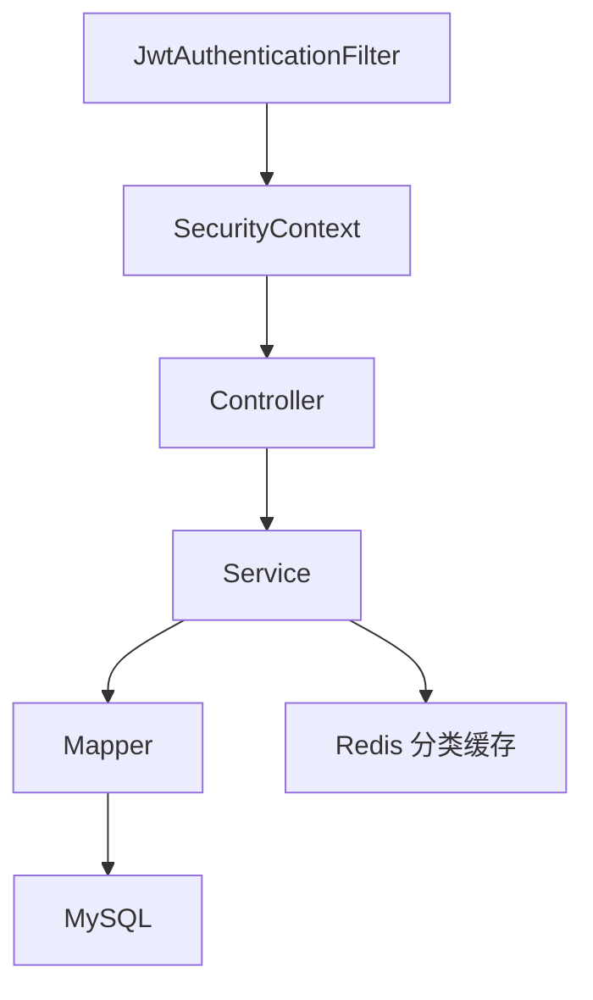
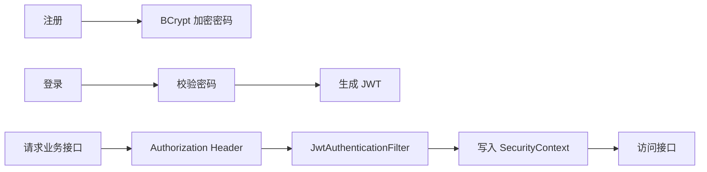

# 校园二手交易与后台管理系统

## 项目简介

`campus-market-admin` 是一个面向 Java 后端开发实习的个人学习、复现与二次开发项目。项目实现了用户注册登录、JWT 鉴权、商品发布与分页查询、分类 Redis 缓存、订单状态流转、后台管理等常见后端能力。

## 技术栈

- Java 17 release
- Spring Boot 3.x
- Spring Security 6
- JWT
- MyBatis-Plus
- MySQL 8
- Redis
- springdoc-openapi
- Lombok

## 功能列表

- 用户注册、登录
- BCrypt 密码加密
- JWT token 生成和解析
- 商品发布、修改、删除、分页查询、详情查询
- 分类查询和 ADMIN 分类管理
- Redis 分类列表缓存
- 订单创建、支付、取消、完成
- ADMIN 用户、商品、订单管理
- 管理员下架商品

## 项目架构图



## 登录认证流程图



## 数据库表设计

- `sys_user`：用户表，角色为 `USER`、`ADMIN`
- `market_category`：商品分类表
- `market_goods`：商品表，状态为 `ON_SALE`、`LOCKED`、`SOLD`、`OFF_SHELF`
- `market_order`：订单表，状态为 `CREATED`、`PAID`、`CANCELED`、`FINISHED`

## 快速启动步骤

```powershell
cd resume-projects/campus-market-admin
mysql -uroot -proot < scripts/init.sql
mysql -uroot -proot < scripts/sample-data.sql
mvn spring-boot:run
```

## 本地 MySQL/Redis 启动方式

MySQL 默认配置：

- URL：`jdbc:mysql://localhost:3307/campus_market`
- 用户名：`root`
- 密码：`root`

Redis 默认配置：

- host：`localhost`
- port：`6379`

Redis 不可用时，分类缓存降级为直接查 MySQL。

## Docker Compose 可选启动方式

```powershell
docker compose up -d
```

如果使用当前 `docker-compose.yml`，MySQL 映射到本机 `3307`，Redis 映射到本机 `6380`。如需应用连接 Docker Redis，可启动时设置 `REDIS_PORT=6380`。

## Swagger 地址

- `http://localhost:8082/swagger-ui/index.html`

## 接口示例

登录：

```json
{"username":"student1","password":"123456"}
```

发布商品：

```json
{"categoryId":1,"title":"Java Textbook","description":"Used book","price":35.00}
```

创建订单：

```json
{"goodsId":1}
```

## Redis 使用场景

分类列表使用 `market:category:list` 缓存。查询分类时先读 Redis，未命中再查 MySQL 并写入 Redis；新增、修改、删除分类后删除缓存。

## JWT 鉴权流程

登录成功后返回 token。访问受保护接口时请求头携带：

```text
Authorization: Bearer <token>
```

`JwtAuthenticationFilter` 解析 token，写入 `SecurityContext`。`/api/admin/**` 只允许 ADMIN 角色访问。

## 事务使用场景

订单创建、支付、取消涉及订单状态和商品状态的同步修改，使用 `@Transactional` 保证要么一起成功，要么一起回滚。

## 面试讲解重点

- Spring Security 6 为什么使用 `SecurityFilterChain`
- JWT 如何生成、解析和写入 SecurityContext
- sellerId 为什么来自当前登录用户
- 分类缓存如何处理 Redis 不可用和缓存删除
- 订单创建、支付、取消为什么要使用事务

## 简历写法

建议写成“基于 Spring Boot 的校园二手交易后端项目”，强调接口开发、JWT 鉴权、MyBatis-Plus、MySQL、Redis 缓存和订单事务。不要写真实支付、复杂权限系统或微服务架构。

## 参考项目与致谢

参考 [macrozheng/mall-learning](https://github.com/macrozheng/mall-learning) 的 Spring Boot、MyBatis、Redis、JWT 和 mall-tiny 后端项目组织思路。本项目为个人学习、复现与二次开发项目，不将参考项目表述为完全原创。
