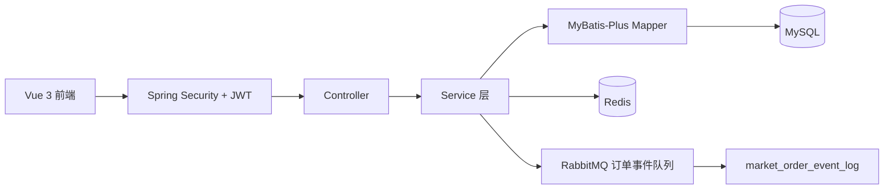
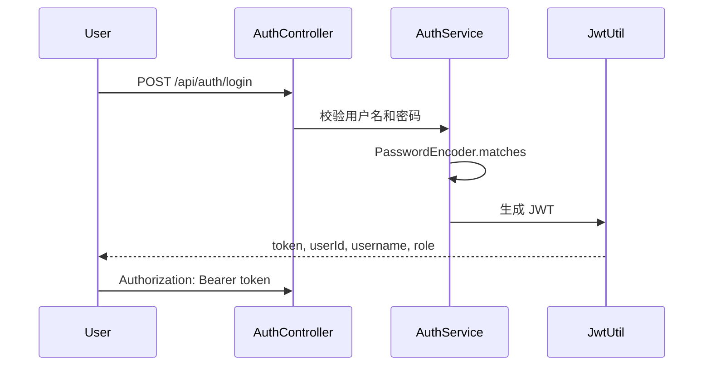

# campus-market-admin

校园二手交易与后台管理系统是一个个人学习、复现与二次开发项目，用 Spring Boot 实现注册登录、JWT 鉴权、商品、分类、订单、后台管理，并补充 Redis 缓存、RabbitMQ 订单事件日志和 Vue 3 前端演示。

## 技术栈

- 后端：Java 17、Spring Boot 3、Spring Security 6、JWT、MyBatis-Plus、SpringDoc OpenAPI
- 数据：MySQL
- 缓存：Redis 分类列表缓存、热商品页缓存
- 消息队列：RabbitMQ 订单事件日志
- 前端：Vue 3、Vite、Element Plus、Pinia、Axios

## 功能列表

- 注册、登录，密码 BCrypt 加密
- JWT Filter 解析 `Authorization: Bearer <token>`
- USER / ADMIN 两种角色，`/api/admin/**` 只允许 ADMIN
- 商品发布、修改、删除、分页查询、详情
- 分类列表 Redis 缓存，ADMIN 分类维护后删除缓存
- 订单创建、支付、取消、完成，创建订单使用事务
- ADMIN 用户、商品、订单列表，管理员下架商品
- RabbitMQ 记录订单状态变更事件到 `market_order_event_log`

## 架构图



## 登录认证流程



## 数据库表设计

- `sys_user`：用户、密码、角色
- `market_category`：商品分类
- `market_goods`：商品
- `market_order`：订单
- `market_order_event_log`：订单事件日志

SQL 字段使用下划线，Java Entity 使用驼峰命名。

## 快速启动

```powershell
docker compose up -d
mvn spring-boot:run
```

前端：

```powershell
cd frontend
npm install
npm run dev
```

地址：

- 后端：http://localhost:8082
- 前端：http://localhost:5174
- Swagger：http://localhost:8082/swagger-ui.html
- RabbitMQ 管理台：http://localhost:15673，账号密码 `guest/guest`

## 本地 MySQL / Redis / RabbitMQ

`docker-compose.yml` 默认暴露 MySQL `3307`、Redis `6380`、RabbitMQ `5673`，应用默认配置也对应这些端口。可用环境变量覆盖 `MYSQL_URL`、`REDIS_PORT`、`RABBITMQ_PORT`。

## 接口示例

```powershell
curl http://localhost:8082/api/health
curl -X POST http://localhost:8082/api/auth/login -H "Content-Type: application/json" -d "{\"username\":\"student1\",\"password\":\"123456\"}"
curl -X POST http://localhost:8082/api/goods -H "Authorization: Bearer <token>" -H "Content-Type: application/json" -d "{\"categoryId\":1,\"title\":\"Java书\",\"description\":\"二手教材\",\"price\":30}"
```

完整接口见 `docs/api.md`。

## Redis 使用场景

- `market:category:list`：分类列表缓存，新增、修改、删除分类后删除。
- `market:goods:hot`：第一页未筛选商品缓存，商品创建、修改、删除、下架后删除。
- Redis 不可用时降级查 MySQL，不影响主流程。

## JWT 鉴权流程

`SecurityConfig` 使用 `SecurityFilterChain`，注册登录和 Swagger 放行，业务接口要求认证，`/api/admin/**` 要求 ADMIN。`JwtAuthenticationFilter` 继承 `OncePerRequestFilter`，解析 Bearer token 后写入 `SecurityContext`。

## 事务使用场景

`OrderServiceImpl#createOrder` 使用 `@Transactional`：创建订单前校验商品存在、状态为 `ON_SALE`、不能购买自己的商品；创建后把商品改为 `LOCKED`。支付后改为 `SOLD`，取消未支付订单后恢复 `ON_SALE`。

## 面试讲解重点

重点讲清楚 Spring Security 6 配置、JWT 生成与解析、BCrypt、Redis 缓存降级、订单事务和状态流转、RabbitMQ 订单事件日志。

## 简历写法

建议写成“个人学习、复现与二次开发项目”，强调 Spring Boot、MyBatis-Plus、MySQL、Redis、RabbitMQ、JWT、接口开发、数据库设计，不写高并发、微服务、真实支付。

## 参考项目与致谢

参考了常见校园二手交易、后台管理和 Spring Security 学习项目的公开思路，并结合实习简历场景做了二次开发。
