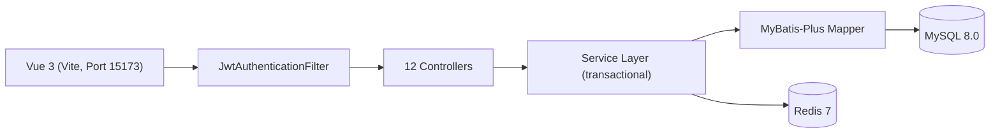

# 架构说明

## 分层

| 层 | 职责 | 关键组件 |
|----|------|----------|
| Security | JWT 认证 + 角色鉴权 | `SecurityConfig`、`JwtAuthenticationFilter`、`CustomUserDetailsService` |
| Controller | REST API，参数校验，返回统一 Result | 12 Controllers（Auth/User/File/Goods/Category/Order/Payment/Favorite/Message/Review/Report/Admin） |
| Service | 业务逻辑、事务、缓存、日志记录 | 11 ServiceImpl |
| Mapper | MyBatis-Plus 数据访问 | 13 Mapper + BaseMapper |
| Redis | 分类缓存 + 热商品缓存（带降级） | `CategoryServiceImpl`、`GoodsServiceImpl` |
| Entity | 13 张表映射 | `entity/` 包 |

## 前后端分离

- 后端：Spring Boot 3.3（Port 8082）
- 前端：Vue 3 + Vite（Port 15173）→ Vite proxy `/api` → 后端
- 公开接口无需登录：health、login、register、goods 列表/详情、categories、reviews

## 关键文件

- `SecurityConfig.java` — Spring Security 6 配置
- `JwtAuthenticationFilter.java` — JWT 过滤器
- `OrderServiceImpl.java` — 订单创建（条件 UPDATE 防并发） + 状态流转
- `PaymentServiceImpl.java` — 模拟支付（事务内写 payment_record + order_log）
- `GoodsServiceImpl.java` — 商品发布审核流 + 热商品缓存
- `CategoryServiceImpl.java` — Redis 分类缓存 + 降级
- `FavoriteServiceImpl.java` — 收藏（计数同步 + 唯一约束）
- `MessageServiceImpl.java` — 站内消息（会话 + 未读数）
- `ReviewServiceImpl.java` — 评价（仅 FINISHED 订单）
- `ReportServiceImpl.java` — 举报（PENDING → RESOLVED/REJECTED）
