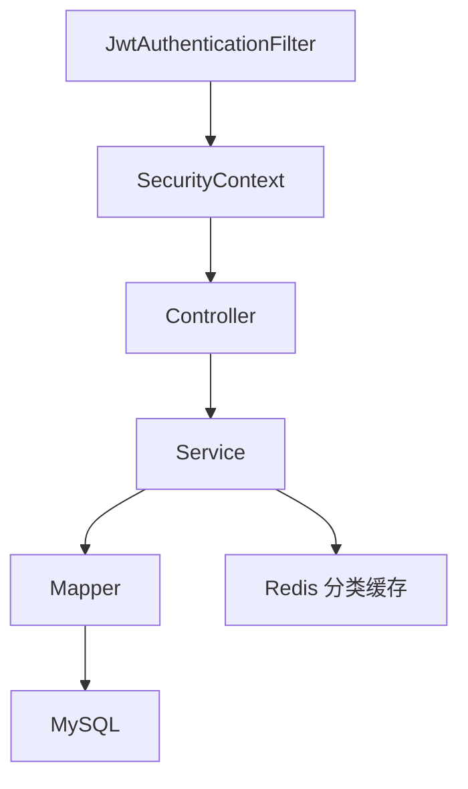

# 架构说明

当前项目采用单体 Spring Boot 分层结构。

## 分层

- `security`：JWT、过滤器、登录用户模型
- `config`：Spring Security、OpenAPI、Redis、MyBatis-Plus 配置
- `controller`：认证、商品、分类、订单、后台管理接口
- `service`：业务接口
- `service.impl`：业务实现
- `mapper`：MyBatis-Plus 数据访问
- `entity`：数据库表映射
- `dto`：请求参数
- `vo`：登录返回等响应对象
