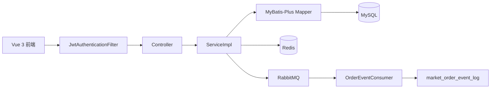

# 架构说明

## 分层

- Security：`SecurityConfig`、`JwtAuthenticationFilter`、`CustomUserDetailsService`。
- Controller：认证、商品、分类、订单、后台接口。
- Service：业务校验、事务、缓存、消息发送。
- Mapper/Entity：MyBatis-Plus 访问 MySQL。
- Redis：分类列表缓存和热商品页缓存。
- RabbitMQ：订单创建、支付、取消、完成后发送事件，消费者保存日志。

## 关键代码

- `src/main/java/com/liminghan/market/config/SecurityConfig.java`
- `src/main/java/com/liminghan/market/security/JwtAuthenticationFilter.java`
- `src/main/java/com/liminghan/market/service/impl/OrderServiceImpl.java`
- `src/main/java/com/liminghan/market/service/impl/CategoryServiceImpl.java`
- `src/main/java/com/liminghan/market/mq/OrderEventConsumer.java`
