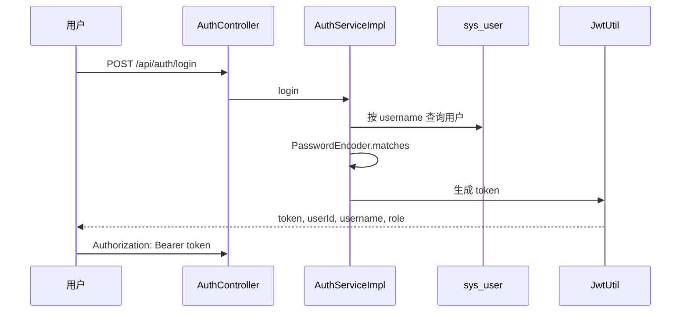

# 登录认证流程

## 认证规则

- `/api/auth/register`、`/api/auth/login`、`/api/health`、Swagger 路径放行。
- 普通业务接口需要登录。
- `/api/admin/**` 需要 `ADMIN` 角色。
- 使用 Spring Security 6 的 `SecurityFilterChain`，没有使用 `WebSecurityConfigurerAdapter`。
- 密码使用 BCrypt 保存，`sample-data.sql` 中也使用 BCrypt hash。
