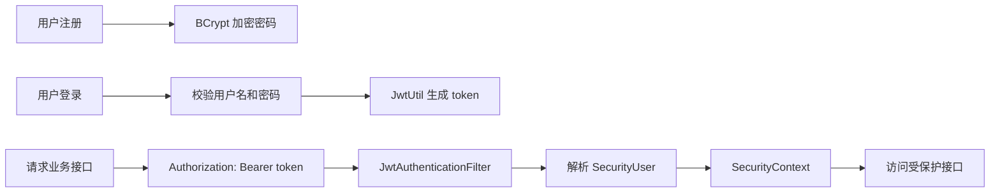

# 登录认证流程

当前阶段使用 Spring Security 6，不使用 `WebSecurityConfigurerAdapter`。

## 权限规则

- `/api/health`、`/api/auth/register`、`/api/auth/login` 放行。
- `/api/admin/**` 仅允许 `ADMIN` 角色访问。
- 其他接口需要登录。

## 关键类

- `SecurityConfig`
- `JwtUtil`
- `JwtAuthenticationFilter`
- `CustomUserDetailsService`
- `SecurityUser`
