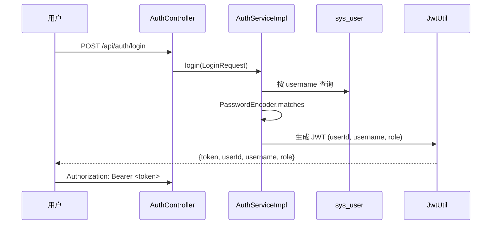
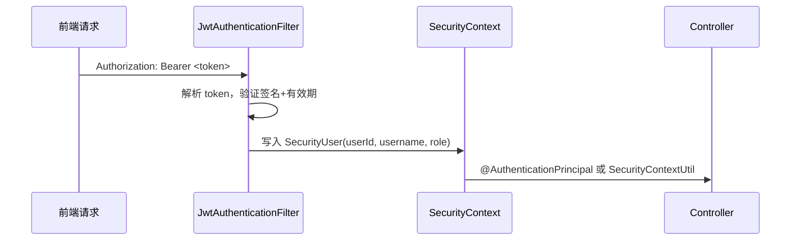

# 登录认证流程

## JWT 验证流程

## 认证规则

| 接口范围 | 访问要求 |
|----------|----------|
| `/api/health` | 公开 |
| `/api/auth/register`、`/api/auth/login` | 公开 |
| `/api/categories`、`/api/goods/page`、`/api/goods/*`（GET） | 公开 |
| `/api/reviews/goods/*`、`/api/reviews/users/*`（GET） | 公开 |
| `/swagger-ui/**`、`/v3/api-docs/**` | 公开 |
| `/api/admin/**` | ADMIN 角色 |
| 其他所有接口 | 需要登录（任意角色） |

## 技术细节

- `SecurityConfig` 使用 `SecurityFilterChain` Bean（非 `WebSecurityConfigurerAdapter`）
- `JwtAuthenticationFilter` 继承 `OncePerRequestFilter`，在 `UsernamePasswordAuthenticationFilter` 之前插入
- Session 策略：`STATELESS`（无状态）
- CSRF：已关闭（API 不需要）
- 密码：BCrypt 加密，`PasswordEncoder.matches()` 校验
- 角色：`SecurityUser` 实现 `UserDetails`，`getAuthorities()` 返回 `ROLE_USER` 或 `ROLE_ADMIN`
