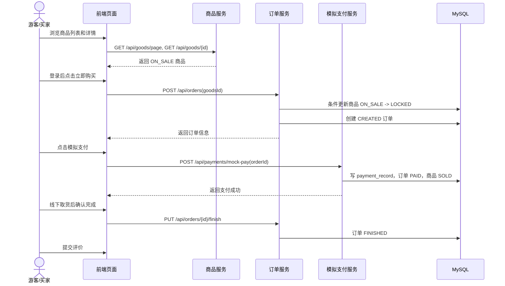
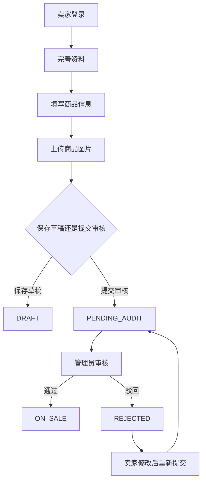
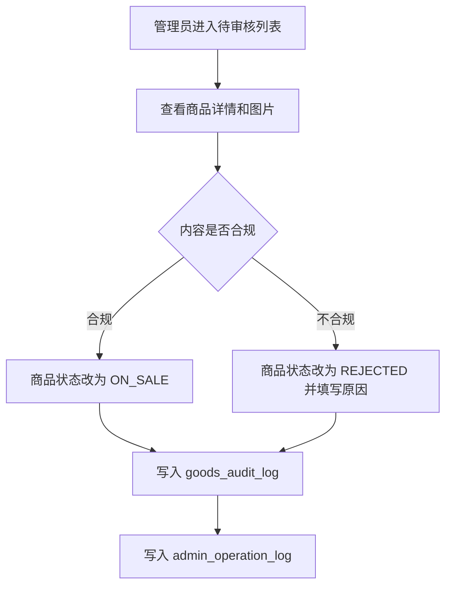
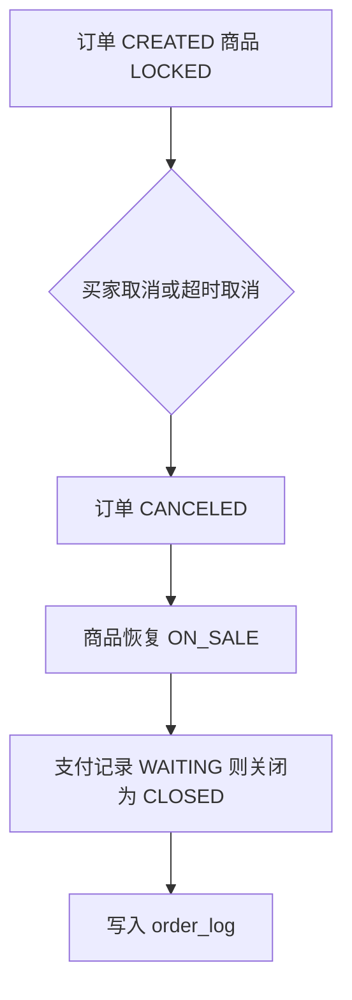
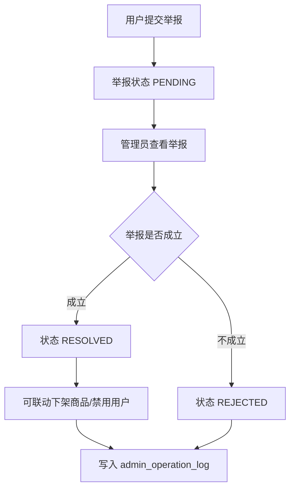

# 02 用户旅程

## 1. 买家购买流程

关键规则：

1. 游客可以浏览商品，但下单前必须登录。
2. 买家不能购买自己发布的商品。
3. 只有 `ON_SALE` 商品可以创建订单。
4. 创建订单成功后商品状态变为 `LOCKED`。
5. 模拟支付成功后订单变为 `PAID`，商品变为 `SOLD`。
6. 只有 `FINISHED` 订单可以评价。

## 2. 卖家发布流程

卖家规则：

1. 发布时必须选择启用状态的分类。
2. 至少填写标题、描述、价格、交易地点和一张图片。
3. 审核通过前商品不出现在普通商品列表。
4. 商品被锁定、售出后不能编辑核心信息。
5. 审核驳回后可以修改并重新提交审核。

## 3. 管理员审核流程

审核规则：

1. 只有 `PENDING_AUDIT` 商品可以审核。
2. 审核通过后状态改为 `ON_SALE`。
3. 审核驳回后状态改为 `REJECTED`，必须保存原因。
4. 每次审核必须写入审核日志和管理员操作日志。

## 4. 订单取消流程

取消规则：

1. 只有 `CREATED` 订单可以取消。
2. 取消后商品恢复 `ON_SALE`。
3. 已支付订单不能直接取消，第一版不做退款流程。

## 5. 举报处理流程

举报规则：

1. 举报对象支持商品、用户、消息、订单。
2. 管理员处理时必须填写处理结果。
3. 管理员处理动作需要留痕。
