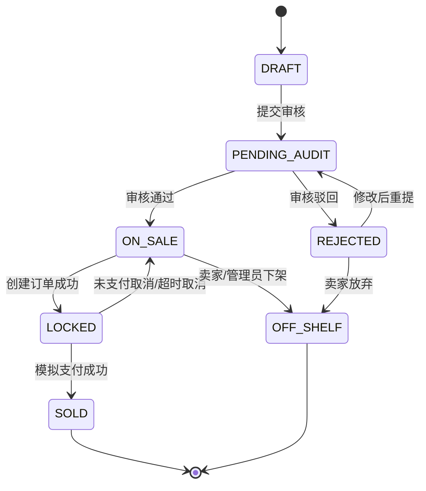
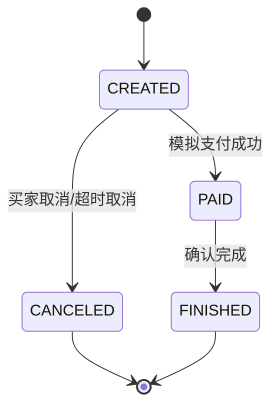
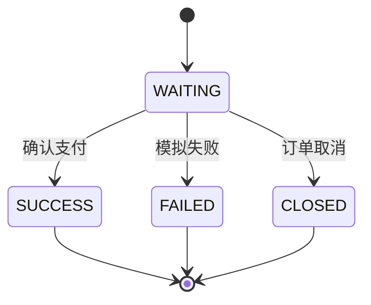
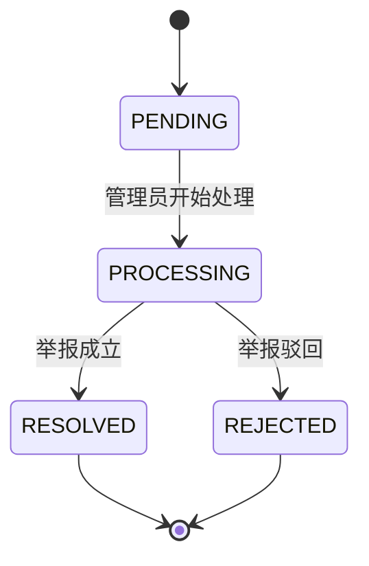

# 04 状态机设计

本文件是项目状态机的单一事实源。后续数据库、接口、前端和项目文档中的状态名称必须与本文件一致。

## 商品状态 `GoodsStatus`

| 状态 | 说明 |
| --- | --- |
| `DRAFT` | 草稿，卖家保存但未提交审核 |
| `PENDING_AUDIT` | 待审核，等待管理员审核 |
| `ON_SALE` | 在售，游客可浏览，登录用户可下单 |
| `LOCKED` | 已被订单锁定，等待买家支付 |
| `SOLD` | 已售出，不可再购买 |
| `OFF_SHELF` | 已下架，卖家或管理员主动下架 |
| `REJECTED` | 审核驳回，卖家可修改后重新提交 |

> 不再单独维护 `audit_status`。审核状态由 `goods.status` 表示，审核过程由 `goods_audit_log` 留痕。



## 订单状态 `OrderStatus`

| 状态 | 说明 |
| --- | --- |
| `CREATED` | 已创建，待支付 |
| `PAID` | 已模拟支付，等待线下交付 |
| `CANCELED` | 已取消 |
| `FINISHED` | 已完成 |



订单规则：

1. `CREATED` 才能支付或取消。
2. `PAID` 才能确认完成。
3. `CANCELED`、`FINISHED` 是终态。
4. 第一版不做退款状态。

## 支付状态 `PaymentStatus`

| 状态 | 说明 |
| --- | --- |
| `WAITING` | 支付记录已创建，等待确认 |
| `SUCCESS` | 模拟支付成功 |
| `FAILED` | 模拟支付失败 |
| `CLOSED` | 订单取消导致支付关闭 |



## 举报状态 `ReportStatus`

| 状态 | 说明 |
| --- | --- |
| `PENDING` | 待处理 |
| `PROCESSING` | 管理员处理中 |
| `RESOLVED` | 举报成立并处理完成 |
| `REJECTED` | 举报不成立 |



## 用户状态 `UserStatus`

| 状态 | 说明 |
| --- | --- |
| `ENABLE` | 正常可用 |
| `DISABLED` | 已禁用，不允许登录或操作 |

## 分类状态 `CategoryStatus`

| 状态 | 说明 |
| --- | --- |
| `ENABLE` | 启用，可发布商品 |
| `DISABLED` | 禁用，不可用于新商品发布 |

## 订单并发控制设计

为了避免两个用户同时购买同一件商品，创建订单时必须使用**带状态条件的更新**锁定商品：

```sql
UPDATE market_goods
SET status = 'LOCKED', updated_at = NOW()
WHERE id = ? AND status = 'ON_SALE';
```

业务规则：

1. 影响行数为 1：锁定成功，可以创建订单。
2. 影响行数为 0：商品已被锁定、售出、下架或不存在，订单创建失败。
3. 该更新和订单创建必须放在同一个事务中。
4. 不要采用“先查商品状态，再无条件更新”的方式，否则并发下可能重复下单。
